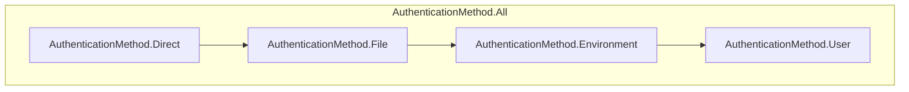

We may use specific `AuthenticationMethod` when calling `KaggleClient.Authenticate()`. *Given an instantiated KaggleClient, we can call `Authenticate()` as many times as we need on the same client.*

By default, the `method` parameter is set to `AuthenticationMethod.Auto`. Internally, the client iterates through each `AuthenticationMethod` in order, then stops at (and returns) the successful `AuthenticationMethod`.

`AuthenticationMethod` is prioritized top to bottom as follows:



We examine each authentication method:


### AuthenticationMethod.Direct

Authenticate our client using **only** `username` and `key` from the provided configuration.

* Usage:

```csharp
var config = new KaggleConfiguration { username = "YourUsername", key = "YourKey" };

var api = new KaggleClient();
api.Authenticate(config, method: AuthenticationMethod.Direct);
```

### AuthenticationMethod.File

Authenticate our client using **only** the `filename` parameter in `KaggleClient.Authenticate()`. `filename` is the path to a .json file under this schema: `{"username": string, "key": string}`

* Suppose a file `kaggle.json`. The content of `kaggle.json` should be `{"username": "petterpet", "key": "mytotallyrandomkey"}`

* Usage:

```csharp
var api = new KaggleClient();
AuthenticationMethod method = api.Authenticate(
    filename: @"kaggle.json",
    method: AuthenticationMethod.File
);
```
### AuthenticationMethod.Environment

Authenticate our client using **only** two environment variables of `KAGGLE_USERNAME` and `KAGGLE_KEY`. Under the hood, our client calls 
```csharp
Environment.GetEnvironmentVariable("KAGGLE_USERNAME") //or "KAGGLE_KEY"
```
to get the username and key

* Usage:

```csharp
// Assign the environment variable at some place
Environment.SetEnvironmentVariable("KAGGLE_USERNAME", MockUsername);
Environment.SetEnvironmentVariable("KAGGLE_KEY", MockKey);

var api = new KaggleClient();
AuthenticationMethod method = api.Authenticate(method: AuthenticationMethod.Environment);
```
### AuthenticationMethod.User

Authenticate our client using **only** `kaggle.json`. Similar to `AuthenticationMethod.File`, but the containing directory is defined as follows:
* First, retrieve and use the directory given as the `KAGGLE_CONFIG_DIR` environment variable (if defined).
* If no `KAGGLE_CONFIG_DIR` environment variable is set beforehand, use `{UserProfile_Directory}/.kaggle/`, where `{UserProfile_Directory}` is
```csharp
Environment.SpecialFolder.UserProfile
```

After obtaining a valid path to our `kaggle.json` file, the client authenticates similarly to `AuthenticationMethod.File`.

* Usage:

```csharp
// (Optional) assign the environment variable
Environment.SetEnvironmentVariable("KAGGLE_CONFIG_DIR", "@D:/KaggleNET/");

var api = new KaggleClient();
AuthenticationMethod method = api.Authenticate(method: AuthenticationMethod.User);
```